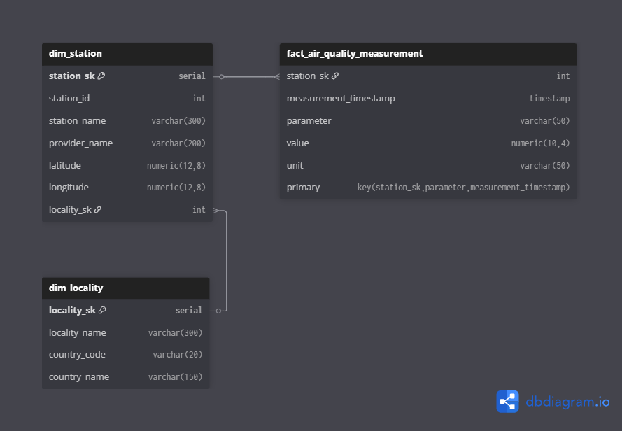

# Pipeline de Datos OpenAQ

Un pipeline de datos que recolecta información de calidad del aire desde la API de OpenAQ, la almacena en una base de datos PostgreSQL y procesa mediciones de calidad del aire de estaciones alrededor del mundo.

## Descripción General

Este pipeline procesa datos de calidad del aire mediante:
- Obtención de metadatos de países, localidades y estaciones desde la API de OpenAQ (api.openaq.org)
- Almacenamiento de datos estructurados en una base de datos PostgreSQL
- Procesamiento de mediciones de calidad del aire para cada estación en la localidad especificada

## Requisitos

- Docker

## Inicio Rápido

1. Clona este repositorio

2. Ejecuta el pipeline con un país y localidad específicos:

```bash
./run.sh "Chile" "Santiago"
```

Reemplaza `"Chile"` y `"Santiago"` con cualquier nombre de país y localidad válidos.

- Otros ejemplos:
  - `./run.sh "United Kingdom" "London"`
  - `./run.sh "Argentina" "Buenos Aires"`

## Estructura del Proyecto

```
├── Dockerfile             # Definición del contenedor de la aplicación
├── compose.yml            # Configuración de servicios Docker
├── init-scripts           # Scripts de inicialización de la base de datos
├── requirements.txt       # Dependencias de Python
├── run.sh                 # Script principal de ejecución
└── src                    # Código fuente de Python
    ├── config             # Gestión de configuración
    ├── db                 # Conexión y operaciones de base de datos
    ├── etl                # Lógica de extracción y procesamiento de datos
    ├── insights           # Consultas SQL y funciones de reportes
    ├── utils              # Cliente API y funciones auxiliares
    └── main.py            # Punto de entrada de la aplicación
```

## Arquitectura

El pipeline consta de dos componentes principales:
- **Base de datos PostgreSQL**: Almacena metadatos de países, localidades, estaciones y mediciones de calidad del aire
- **Aplicación Python**: Maneja procesos ETL utilizando la arquitectura del pipeline OpenAQ

### Esquema de Base de Datos

- **config_country**: Datos de países
- **config_parameter_to_monitor**: Configuración de parámetros de calidad del aire a monitorear
- **dim_locality**: Datos dimensionales de localidades  
- **dim_station**: Datos dimensionales de estaciones de calidad del aire
- **fact_air_quality_measurement**: Tabla de hechos con mediciones de calidad del aire
- **ctrl_parameter_high_watermark**: Tabla de control para carga incremental por estación y parámetro



El diseño implementa un modelo snowflake pequeño y configurable, donde nuevos parámetros de calidad del aire pueden agregarse fácilmente a través de la tabla `config_parameter_to_monitor`.

### Proceso ETL

1. Procesar información del país y obtener country_id
2. Procesar estaciones para la localidad especificada
3. Para cada estación, obtener y procesar mediciones de calidad del aire
4. Almacenar todos los datos en las tablas dimensionales y de hechos correspondientes


